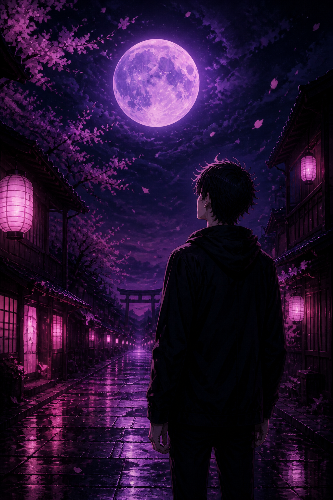
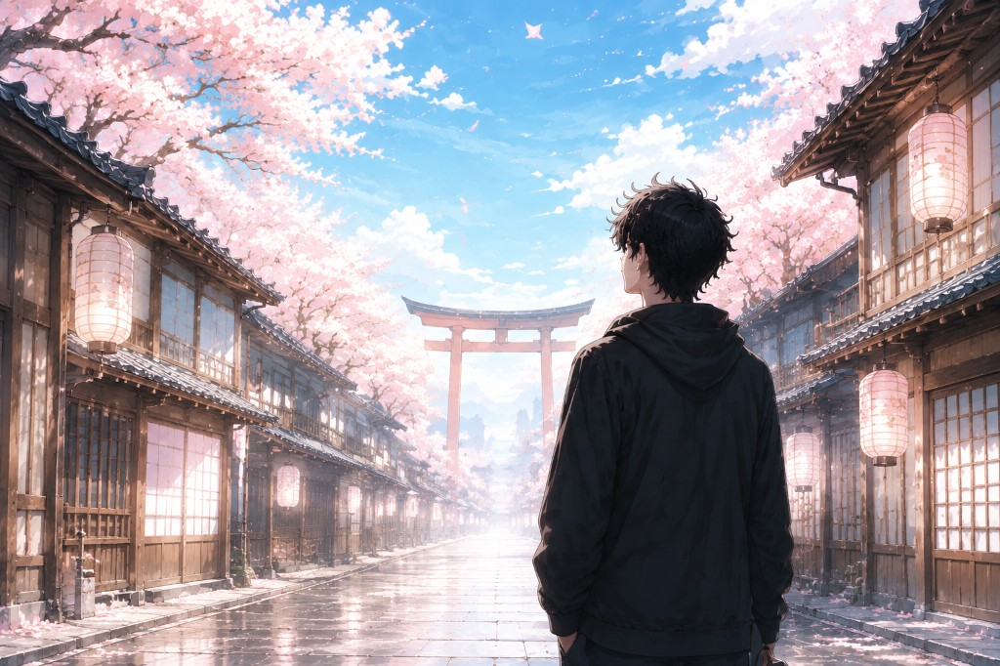
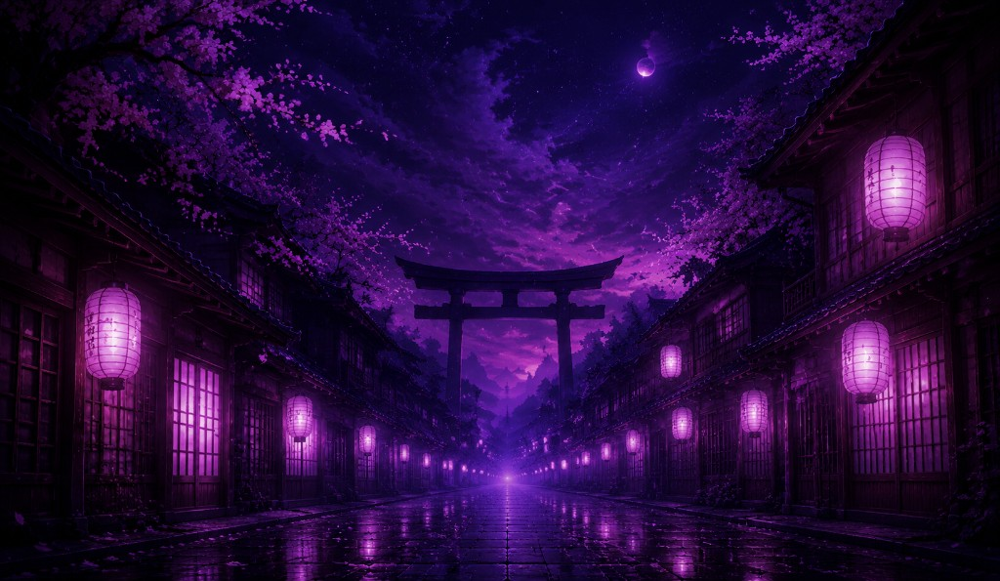

# apobyte 🌙

> I build modern, scalable, and suspiciously beautiful web experiences. The moon is not a dependency.

Personal portfolio of **apobyte**, a full stack developer. By night the site is a rain-soaked lantern street under a purple moon. By day the same street wakes up under cherry blossoms. Pages are static [Astro](https://astro.build). The pieces that need a browser — theme, project filters, and the contact form — are [React](https://react.dev) islands.

**See it live:** [apobyte](https://apoleo.dev)

<p align="center">
  
</p>

<p align="center"><i>Night mode. The moon is doing the heavy lifting. 🌕</i></p>

## So you found the portfolio 👀

A few notes for anyone scrolling through:

- ☔ Welcome. Wipe your feet. The street is wet on purpose.
- 🌸 The petals are not a bug. They have a schedule.
- 🙇 If the page bows before it appears, that is the loading screen being polite.
- ☀️ Light mode is for people who open laptops near windows. The sun is optional. The code is not.
- 📖 The skills page calls itself a grimoire. Your stack is probably in there, wearing a little seal.
- 🗂️ The project filters exist so you can pretend you are not going to click all of them.
- 📬 The contact form says thank you, then admits it does not email anyone yet. A real human still reads the address on the page.
- 🛑 Copying this site will not make you apobyte. It will make you late, and it will make you wrong. The license is at the bottom. It is not a joke.

## What this portfolio is ⛩️

This is a one-person site with a whole street of atmosphere.

The home page is a short hello, a strip of featured skills, and a door into the work. About is the biography and the jobs. Skills is arranged like a spellbook: schools, seals, and named stacks such as MERN and PERN. Projects is a filterable gallery — web apps, CMS, dashboards, and tools — and each one carries a stack, a few features, and screenshots. Blog is short field notes. Contact is email, phone, and a form that currently lives entirely in the browser.

Flip the theme and the alley turns into daylight. Same torii. Fewer existential moons. Sakura still falls, because some habits are structural.

| 🌙 Home, after dark | 🌸 Home, in the sun |
| :--- | :--- |
|  |  |

| 🌃 Projects at night | ☀️ Projects at noon |
| :--- | :--- |
|  |  |

## Stack 🛠️

- 🚀 Astro 7 for pages, layouts, view transitions, and static output
- ⚛️ React 19 for client islands (`client:load`)
- 📘 TypeScript, strict
- 🟢 Node.js 22.12 or newer

Fonts are self-hosted — Outfit, Kaushan Script, and a set of Japanese display faces — so a cold browser still gets the right letters.

## Run it locally 💻

```sh
npm install
npm run dev
```

Then open [http://localhost:4321](http://localhost:4321). Try not to get lost under the torii. ⛩️

## Map 🗺️

| Path | What you get |
| :--- | :--- |
| `/` | Home — intro, featured skills, the alley |
| `/about` | About and experience |
| `/skills` | The grimoire, plus stack pacts |
| `/projects` | Filterable project gallery |
| `/blog` | Notes, one page each at `/blog/[slug]` |
| `/contact` | Email, phone, and the honest little form |

Header, footer, theme, loading screen, and the sakura overlay come from `src/layouts/BaseLayout.astro`.

## Where the words live 📝

| File | It controls |
| :--- | :--- |
| `src/data/site.ts` | Name, role, tagline, email, phone, socials, nav |
| `src/data/experience.ts` | Work history |
| `src/data/skills.ts` | Skills, schools, featured seals |
| `src/data/stacks.ts` | Named stacks on the skills page |
| `src/data/projects.ts` | Cards, filters, features, image paths |
| `src/data/blog.ts` | Titles, dates, excerpts, paragraphs |

Screenshots and icons sit in `public/images/` and `public/icons/`.

React only wakes up where the page needs a brain:

```astro
<ThemeToggle client:load />
<ProjectGallery client:load projects={projects} />
<ContactForm client:load />
```

The contact form confirms in the browser and does not send mail. Theme follows `localStorage` (`theme`) and otherwise trusts the system.

## Commands ⚡

| Command | Action |
| :---------------- | :------------------------------------------ |
| `npm run dev` | Start the local dev server |
| `npm run build` | Build production output to `./dist/` |
| `npm run preview` | Preview the production build locally |

## License 📜

Copyright © 2026 **apobyte**. All rights reserved.

This portfolio is not a starter kit. The design, layout, copy, animations, and original artwork belong to apobyte.

You may look. You may not copy.

No cloning this repo to reskin it as your own site. No lifting the pages, the CSS, the components, the writing, or the images into another portfolio, product, or client job. Changing the colors does not make it yours. Written permission, or it stays here.

Astro, React, and the other dependencies keep their own licenses. Those licenses do not cover this portfolio.

The full notice is in [LICENSE](./LICENSE).
